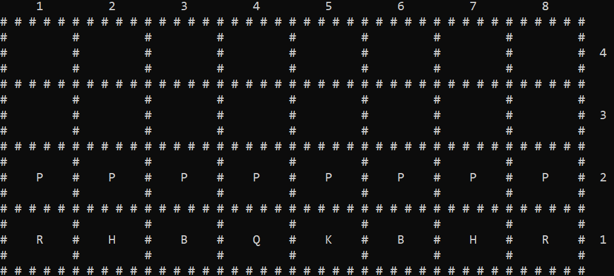

# Terv - Autochess
>Gyarmathy Gábor(LW7L10)
---
## Tartalomjegyzék
1. [Leírás](#leírás)
2. [UML-diagram](#uml-diagram)
3. [Kód általános leírása](#Kód-általános-leírása)
4. [Run() függvény](#Run-függvény)
5. [Menük](#menük)
6. [Editor](#editor)
7. [Fájlkezelés](#fájlkezelés)
8. [User interface](#user-interface)
9. [Generikus lista](#generikus-lista)
10. [Game](#game)
11. [Megjegyzések](#megjegyzések)
---
## Leírás
A sakk egy stratégiai játék, melyben két játékos különböző bábukat mozgatva próbálja meg mattba szorítani az ellenfelét
felváltva lépegetve egy 8x8-as táblán. Ebben a változatban viszont a nevéből fakadóan automatikusan fog egymással játszani a 2 csapat.
A játék a hagyományos sakk szabályaival fog játszódni annyi különbséggel, hogy a játék végét vagy az ellenfél összes bábujának a leütésével szerzi egy csapat, vagy ha a királyt üti le. Sakkot itt majd nem lehet adni, csak a király leütése válik fontossá(vagy ha a csapaton belül nincs király, akkor az ellenséges sereg teljes elpusztítása).

A felhasználó itt az **editorban** tud létrehozni, szerkeszteni, törölni seregeket, amiket a rendes játékban egymás ellen tud csatáztatni egy szimulátorban.

---
## UML-diagram
{ width=86% }

---
## Kód általános leírása

A kódban 3 főbb osztály van amik a program működését magukba foglalják.

- Menu
: Egy menü osztály ami gombokat tartalmaz. Ebből az osztályból épülnek fel a menük a programon belül amikkel lehet tájékozódni a programon belül.

- Editor   
: Ebben az osztályban lehet létrehozni, szerkeszteni vagy kitörölni meglévő seregeket. A seregeket egy 8x4-es térfélen lehet szerkeszteni.

- Game
: Ez szimuláltat két kiválasztott sereget ameddig az egyik nem nyer.

Ezekhez az osztályokhoz mind jár egy külön ui class. Mindegyik ui class egy ős ui classból származik,
és azért felelősek, hogy befogadják a felhasználónak az inputjait és megjelenítsék a menüket/szerkesztőt/játékot.

Ezen ui classok a kódban úgy jönnek létre, hogy minden fő-classhoz(Menu,Editor,Game) tartozik egy Run() függvény.
A Run() túlterhelt függvény megkap egy fő-classt és azt futtatja, emellett létrehozza az őt megjelenítő ui párosát.

A main.cpp csak egy darab függvényhívásból áll, mivel abból indítható minden:
```cpp
int main() {
    Run(MainMenu());
}
```
Ebből le lesz renderelve a **Main menu**, amiben meg tudunk nyitni egy újabb menüt. Ezek a menük mind dinamikusan vannak foglalva. Amint megnyitunk egy menüt, lefoglalódik dinamikusan egy újabb menü és 1-el beljebb lépünk. Amikor egy menün belül megnyitunk egy másikat akkor a külsőbb menü nem lesz felszabadítva, csak onnantól amikor kijjebb lépünk a menüből.

A program fokozatosan van felépítve és kívülről haladunk befele és amilyen mélyen vagyunk annyi memória van külön lefoglalva.

---
## Run() függvény

Ez a függvény futtat le egy adott fő-class objektumot és hoz létre mellé egy ui objektumot aminek a segítségével a felhasználó tud kommunikálni vele.

Minden Run() függvény az alábbi elven működik:
1. Megjelenítés
2. Bemenet várása
3. Vissza az első lépésre, ameddig ki nem lép a funckióból

```cpp
void uiMenu::idle(){
    while(!(menu->getExit())){
        show();     //Megjelenítés
        input();    //Bemenet várása
    }               //Ismétlés
}
```
Az input()-ból következhet az is, hogy belelép egy újabb függvénybe, hiszen ez a modell arra épül, hogy:
1. Küld egy üzenetet a program a felhasználónak `Megjelenítés`
2. A felhasználó válaszol a gépnek `Bemenet`
3. Reagál a gép rá `Megjelenítés újból`

Tehát ez egy oda-vissza kommunikáció amit a ui objektum közvetít a két fél között(Felhasználó és program).

Visszatérve a Run() függvényekre, tehát minden Run() függvény az előbbi protokolt végzi el, hogy az objektumhoz illő ui-nek az idle() függvényét használja fel.

```cpp
void Run(Menu* menuPtr){  //Kap egy Menu pointert
uiMenu menu(menuPtr);    //Létrehozza a hozzá tartozó ui objektumot
menu.idle();             //Elindítja a kommunikációt a Felhasználó és program között
}
```
---
## Menük

- Menu.h
: Ez a program egyik fő-classja. Ehhez tartozik egy `uiMenu` class ami megjeleníti és fogadja a bemeneteket.
Egy menü tartalmaz egy dinamikusan foglalt `Button` tömböt.
    
  - idCounter
    : Számon tartja a tömb méretét, kioszt egy sorszámot minden bejövő új gombnak a menüben.

  - buttons
    : A gombok tömbje.
  
  - exit
    : Ez egy bool érték.Ha a program utasítást kapott arra, hogy kilépjen a jelenlegi menüből, akkor igazzá tevődik, egyébként addig hamis.
  
  - incrementCounter()
  : Megnöveli 1-el az idCountert.
  
  - updateExit()
  : Igazzá teszi az exit boolt.

  - newButton(Button&)
  : Paraméterként kap egy `Button&` referenciát(Ami nincsen dinamikusan foglalva), viszont majd amikor átmásolja magába az értéket, akkor belerakja a dinamikusan foglalt buttons tömbbe.

- Button.h
  : Ezekből van felépítve egy menü. Van benne egy függvénypointer ami akkor fut le, ha a gomb ki van választva a menüben.


    - id
  : Megkapja a menüben lévő jelenlegi id számot(ami egyben a menü mérete is hozzáadás előtt) ebben a változóban.

    - name
  : A név amit a gomb megjelenít.

  - buttonFunction
  : Ez egy funktor osztály, ez tartalmazza a függvény pointert.

- ButtonFunction.h
  : Egy funktor, ami két típusú függvény pointert tartalmazhat:

    - void function(*)()
  : Egy sima üres paraméter-nélküli void függvény pointer

    - void functionArmy(*)(Army*)
  : Egy `Army*` paraméterű void függvény pointer(Ezt például az editor-nél használjuk, amikor megjeleníti a táblát egy függvényből és így kaphat egy meglévő sereget paraméterként).
    
    - armyPointer
  : Az az `Army*` amit átadunk paraméterül a functionArmy(*)(Army*)-nak.

- ButtonFunctions.h
  : *Nem keverendő a Buttonfunction.h-val.* Itt vannak eltárolva a függvénypointerek amiket a gombok létrehozásánal adunk át.

---

## Editor

- Editor.h
: A program második fő-classja. Ez a class foglalkozik egy új sereg készítésével/meglévő szerkesztésével vagy kitörlésével. Ehhez tartozik egy `uiEditor` objektum ami a Felhasználó és a Program közötti kommunikációt biztosítja.

    - army
  : Annak a seregnek a pointere amit szerkeszt. Ha új sereget hozunk létre, akkor a paraméter nélküli konstruktor új sereget hoz létre és nem meglévőt von be.

    - exit
  : Ez egy bool érték, ami akkor lesz igaz, ha a felhasználó ki akar lépni.

  - toDelete
  : Ennek a boolnak akkor lesz igaz az értéke, ha a felhasználó a `uiEditor`-on keresztül kiadta a sereg törlésére a parancsot.

  - searchfor(int x, int y)
  : Egy függvény ami egy `Piece*`-el tér vissza ha az alábbi koordinátákon talál bábut a seregben.

  - saveArmy()
  : Akkor hívódik meg amikor az `uiEditor`-al való kommunkáció segítségével lementjük az új seregünkent. Ez meghívja a megfelelő fájlkezelő-függvényt ami lementi a sereget.

  -editArmy()
  : Automatikusan meghívódik, ha egy nem-új Army-t szerkesztünk és kilépünk belőle. Lementi a változtatásokat.

  - deleteArmy()
  : Ha jelet kap a program a felhasználótól az `uiEditor`-on belül akkor törli a szerkesztésben lévő jelenlegi army-t.
  

---

## Fájlkezelés

- armies.txt
: A lementett seregeket egy `armies.txt`-ben tároljuk, az alábbi rendszer szerint:

```
1. sorban: A seregek darabszáma
2. sorban: A legelső sereg neve  (ez jelöli, hogy a következő tartomény hozzá tartozik)
3. sorban: Az első sereg bábuinak a darabszáma
4. sorban: Az első sereg első bábujának betűjele(bábuknak 1 db charból álló azonosítója van)
5. sorban: Az első sereg első bábujának x koordinátája a táblán
6. sorban: Az első sereg első bábujának y koordinátája a táblán
7. sorban: Az első sereg második bábujának betűjele
...És így tovább

Miért jó ez?
Azért mert adott, hogy hány seregen kell átmennem. Azokon belül adott hogy hány bábun kell átmennem. Bábunként pedig 3 soron kell átmennem.
Ezáltal az egész bejárható 2 ciklusból.
```

- Filemanagement.h
: Ez nem egy osztályt tartalmazó .h fájl, viszont nagyon fontos, fájlkezeléssel foglalkozó függvényeket tartalmaz.

  - ListofArmies(...)
  : Ezt a függvényt használja például az `Editor`, hogy kiolvassa a fájlból a létező seregeket.

  - readTillLine(...)
  : Ez a függvény soronként olvas be a fájlból ahol éppen tart az `ifstream` beolvasás, és addig tart ameddig nem találkozik olyan sorral, amit a legutolsó paraméterben adtunk meg. Eközben kimenti a beolvasott sorokat egy stringeket tartalmazó tárolóba azon sor kivételével ami meg lett adva paraméterként. Ha nincs megadva az utolsó paraméter, akkor viszont az egész fájlt beolvassa és lementi a string tárolóba, ezáltal 2 különböző céllal is fel lehet használni.

  - skipLines(...)
  : Kap egy `ifstream` referenciát és onnantól kihagy annyi sort amennyit az utolsó paraméterben megadunk.

  - writeLines(...)
  : Kap egy `ofstream` referenciát és egy string tárolót. Beleírja sorrendben a string tároló tartalmát a file végébe.

  - writeArmy(...)
  : Kap egy `ofstream` referenciát és egy `Army*`-t. Beleírja a fájl végébe a megkapott sereget.

  - adjustStringNumber(...)
  : Kap egy string referenciát és egy boolt. A string egy számot fog tartalmazni és attól függően, hogy a bool igaz vagy hamis, növeli vagy csökkenti a stringben lévő szám értékét, úgy hogy megtartsa a string mivoltát.

  - AppendArmy(...)
  : Kap egy Army-t és egy fájlnevet, majd az eddigi fájlkezelő függvényeket felhasználva hozzáad egy új sereget a lementettek közé. Először megnöveli a seregek számát majd beilleszti a legvégére az újsereget.

  - EditArmy(...)
  : Kap egy fájlban már létező sereget és módosítja a fájlban a sereget.

  -DeleteArmy(...)
  : Kap egy fájlban már létező sereget és kitörli onnan, egyben csökkenti az első sorban lévő számlálót.

---

## User interface

Van egy abszrakt `ui` osztályunk amiből származik 3 osztály is, amik mind külön-külön a 3 fő-class kezeléséhez és megjelenítéséhez lettek tervezve.

A céljuk az, hogy a Felhasználó és program közötti oda-vissza kommunkációt fenntartsa.

Mivel ezek erősen egybefüggnek a Run() működésével, ezért már részletesen kitértem az idle(),show(),input() függvények működésére. Ehelyett inkább kitérek a táblával foglalkozó függvényre és az érvényes inputokra az `ui` classokon belül.

Fontos kiemelni, hogy **minden** ui osztályban a bemeneteknél a `0` az azt jelenti, hogy kilép a jelenlegi folyamatból eggyel kijjebb.

- uiEditor

  - renderTable()
  : Ez a függvény felelős azért, hogy megjelenítéséért az `Editor`-ből származó sereget a táblán.
  
  
  - show()
: Ez a függvény a válasz a felhasználó bememetére.
   
  ```cpp
    void uiEditor::show(){ 
    clear();            //Minden táblarajzolás előtt letörli a konzolt.
    renderTable();      //Előbbi függvény
    }
    ```
  - clear()
: Letörli a konzolt mielőtt újra felrajzolna. Meg van oldva, hogy mind linux-ra és mind windows rendszerekre egyaránt működjön.
  
  - idle()
: Ez a függvény váltogatja a felhasználó és a program válaszait egymásnak.
  
  ```cpp
    void uiEditor::idle(){
        while(!(editor->getExit())){
        show();
        input();
        }
    }

  ```
  
  - input()
: Ez a függvény kapja meg a bemeneteket és küldi el a programnak.


| Bemenet |                     Válasz                     |
|:-------:|:----------------------------------------------:|
|  K`XY`  |  King bábu létrehozása      (x,y) koordinátán  |
|  Q`XY`  |  Queen bábu létrehozsa     (x,y) koordinátán   |
|  R`XY`  |    Rook bábu létrehozása  (x,y) koordinátán    |
|  H`XY`  | Horse bábu létrehozása      (x,y) koordinátán  |
|  B`XY`  | Bishop bábu létrehozása      (x,y) koordinátán |
|  P`XY`  | Pawn bábu létrehozása       (x,y) koordinátán  |
|  D`XY`  |    Bábu törlése           (x,y) koordinátán    |
| delete  |                 Sereg törlése                  |
|    0    |            Kilépés a szerkesztőből             |


- uiMenu
: Fontos még kiemelni az alábbi classnál, hogy van egy 0. indexű gomb ami mindig visszalép eggyel(tehát kilép a jelénlegi menüből).Ha a főmenüben vagyunk akkor az egész programból ki fog lépni.
: Minden más bemenet egy gombot kell, hogy meg indexeljen, amilyen sorszámot kiír a gombok mellett 1-től számozva(a 0. visszalépés gomb nincs megjelenítve).

---

## Generikus lista

A programban van egy generikusan létrehozott lista is, amit 3 különböző osztály is használ az adatok tárolására.

Van egy Node osztály ami tárolja a `T` típusú adatot.
A Lista pedig ezeket a Nodeokat tárolja láncoltan.
A nodeok mutatnak az előttük meg mögöttük lévő tagokra, és a listának az adattagjai között van egy elejére és végére mutató Node pointer is.

A listához lehet hozzáadni új tagot, törölni, illetve indexelni is.

---

## Game

* Piece.h
: Absztrakt bábu class. Magában értelmetlen, de ez egy seregben heterogén kollekció formájában fellelhető lesz, mert 6 másik class is származik a Piece classból.
  
  * x
: Bábu x koordinátája.

  * y
: Bábu y koordinátája.

  * name
: Egyetlen char, ami a bábu betűjele.

  * piece_moves
  : Egy `Move` tároló. Ha a bábu játékban lesz, akkor itt lesznek tárolva egy adott körön belüli lehetsége lépései.

  * calculateMoves()
  : Ez fogja kiszámítani a bábu lehetséges lépéseit és súlyozni őket.

  
* Army.h

  * nameofAmry
  : maximum 34 karakteres sereg nevét tartalmazó char tömb.

  * sizeofArmy
  : A sereg méretét tartalmazó int.

  * pieces
  : A seregben meglévő bábuk. A bábu class heterogén kollekciója egy generikus listában.

  * addPiece()
: Hozzáad egy új bábut a sereghez a szerkesztőben.

  * deletePiec()
: Kitöröl egy bábut a seregből a szerkesztőben.

  
* Team.h
: A  Game objektumon belül ebből lesz 2.  Konstruktora paraméterként kap egy `Army`-t és annak a bábuit beilleszti a generikus `pieces` listájába, ahonnan a másik csapat majd le tudja ütni a bábuit.

  * pieces
: A bábuit tartalmazó lista.

  * teamMoves
: A bábuinak a lépéseinek az összesített listája. Ebből fogja majd a legnagyobb súlyú lépést megtenni miután kigyűjti az összes bábujának a lépéseit.

  * teamColor
: A csapat színe, ami egy enum érték.

  * army
: Az `army` objektum amiből kimásolódtak a bábui.


* Move
: Egy bábu ebben a típusban tárolja a lépéseit.

  * from
: Egy `Piece*` ami azt tárolja, hogy kitől léphető meg az adott lépés.

  * x
: Az x koordináta ahova léphet.

  * y
: Az y koordináta ahova léphet

  * calcWeight()
: A függvény ami kiszámolja a lépés súlyát, attól függően, hogy milyen bábu áll azon a mezőn ahova léphet. Királytól lefele csökkenőben a súly értéke.

  
* Game.h
: 2 csapatból áll és addig játszódik egy játék ameddig nem nyer az egyik csapat.

: Minden csapatnak van egy saját térfele és egy felállása amit az `Editor`-ban meg lehetett szerkeszteni. Ahhoz hogy a két csapat ne ütközzön, a fekete csapat serege fel van tükrözve a másik térfélre.


  * Team teams*[2]
: a két `Team` pointert eltároló tömb. A `0.` index a fehér, a másik a fekete csapat.

---

## Megjegyzések

* A `Terv`-ben a UML diagrammon és részletes kifejtéseknél nem tértem ki a konstruktorkra, mivel a többi függvényhez képest kevésbé fontos a részletes leírásuk.