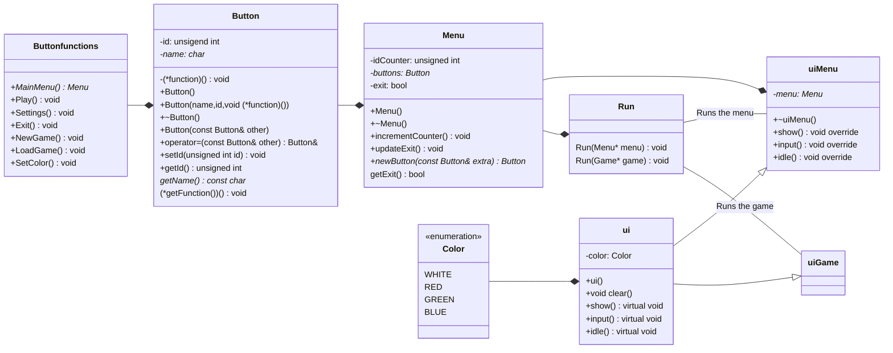

# NHF

```mermaid
classDiagram
    direction LR
class Menu{
    -idCounter: unsigned int
    -buttons: Button*
    -exit: bool
    +Menu()
    +~Menu()
    +incrementCounter() void
    +updateExit() void
    +newButton(const Button& extra) Button*
    getExit() bool
}


class Button{
    -id: unsigend int
    -name: char*
    -(*function)() void
    +Button()
    +Button(name,id,void (*function)())
    +~Button()
    +Button(const Button& other)
    +operator=(const Button& other)Button&
    +setId(unsigned int id) void
    +getId() unsigned int
    getName() const char*
    (*getFunction())() void
}

    class Color{
        <<enumeration>>
        WHITE
        RED
        GREEN
        BLUE
    }


class ui{
    -color: Color
    +ui()
    +void clear()
    +show() virtual void
    +input()virtual void
    +idle() virtual void
}

class uiMenu{
    -menu: Menu*
    +~uiMenu()
    +show() void override
    +input() void override
    +idle() void override
}

class Run{
    Run(Menu* menu) void
    Run(Game* game) void
}

ui--|>uiMenu
ui--|>uiGame


Menu--*uiMenu
Button--*Menu
Buttonfunctions--*Button
Color--*ui
Menu--*Run
Run--uiMenu:Runs the menu
Run--uiGame:Runs the game


class Buttonfunctions{
    +MainMenu() Menu*
    +Play() void
    +Settings() void
    +Exit() void
    +NewGame() void
    +LoadGame() void
    +SetColor() void
}
 
 
 

```