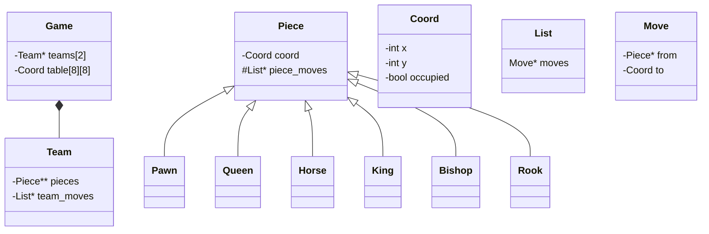

# NHF

```mermaid
classDiagram
class Game{
    -Team* teams[2]
    -Coord table[8][8]

}

Game*--Team

class Team{
    -Piece** pieces
    -List* team_moves
}

class Piece{
    -Coord coord
    #List* piece_moves
}

class Pawn{
    
}

class Horse{
    
}

class Bishop{
    
}

class Rook{
    
}

class King{
    
}

class Queen{
    
}

class Coord{
    -int x
    -int y
    -bool occupied
    
}


class List{
    Move* moves
}

class Move{
    -Piece* from
    -Coord to
}

Piece<|--Pawn
Piece<|--Queen
Piece<|--Horse
Piece<|--King
Piece<|--Bishop
Piece<|--Rook

```